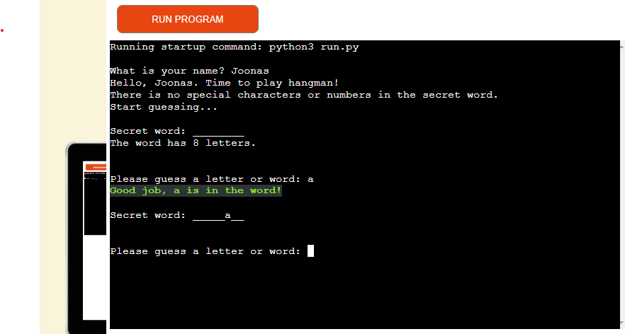
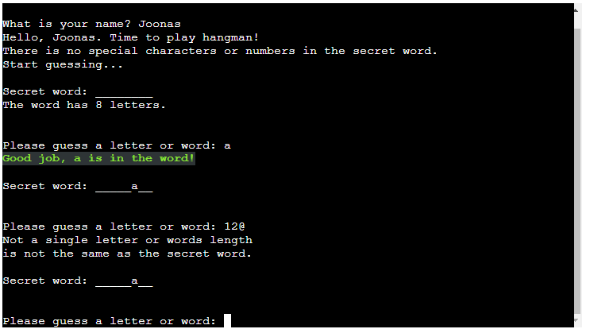
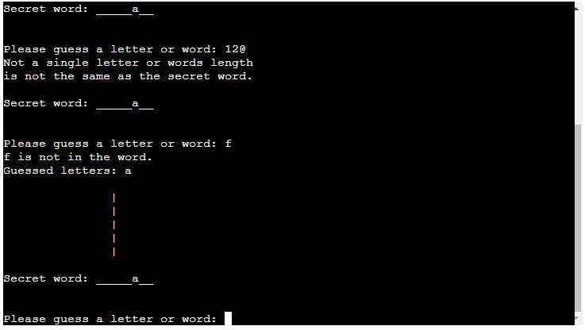
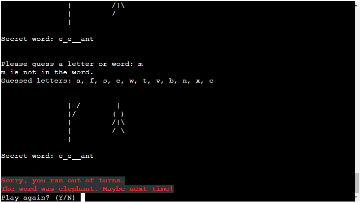

## Hangman game 

#### This interactive word game challenges players to guess the hidden word by carefully selecting letters until the entire word is revealed. Players are initially presented with empty spaces, symbolizing the missing letters they must uncover. The game was specifically developed as part of the Code Institute's Full Stack Software Developer course, serving as the accomplished third Milestone Project.

#### Live Site [Here](#)

#### How to play

* The user need to enter their name and once entered, the game starts and user will be presented the secret word with blank spaces for each letter.

* The user need to type a letter or a word on the keybord.
* If the letter the user choses, exists in the answer, then all the blank spaces, where that letter exists, will be populated with that letter.
* The player have eight tries.
* If the player cannot guess the word and exceeds the lives, the hangman will be completed and the game will be over.

## Features
* The game features a welcome message to the user and when the user starts the game, it will ask the user to type their name. 

* When the user types their name, a hello message will appear displaying their name and the game will begin. The program will also display the number of letters in the word.

* If the letter guessed by the user matches any of the letters in the word, the letter will appear in the blank space where that letter belongs.

* Users are limited to guessing either a letter or a word. If they input a number or a special character, an error message will appear, prompting them to choose a letter or ensure that the length of the word matches the secret word.

* If the letter guessed by the user is incorrect, the hangman picture will be populated piece by piece. If the user selects a letter that has already been chosen, the following message will appear "You already guessed the letter". Also, the wrong letter will be displayed to the user. The following screenshot displays the message. A list with already chosen and wrong letters appears so the user knows wich letters they already choosed.

* If the user is unable to guess the word in 8 attempts, the hangman will be completed and the user will lose the game. The secret word will be displayed to the user. Game will ask user to play again with "Y/N?" question.

* If the user can guess the word, the user will receive a congratulations message and they will win the game.

## Future features

* Show the user how many guesses they have left.

## Technologies used

### Languages
. Python

## Frameworks, Deployement & Libraries

* [Github](https://github.com/)

* [Codeanywhere](https://app.codeanywhere.com/)

* [Heroku](https://heroku.com/)

* VSCode

## Testing

* Testing was done throughout the project mainly by running the program in the terminal as well as python debugger.

* I used the deployed site to manually type correct and incorrect data to validate and see how the program responded.

* I ran program trough CI Python Linter time to times.

## Accessibility

* The whole project was built using python, therefore no other langueges were used.

## Issues and bugs

* 

## Fixed bugs

* Too long lines and whitespaces. I tried using the backslash but i made huge gaps between the text so i used two print messages instead of one.

## Validator Testing
I ran through my file in 

The Code has whitespace and too long lines warnings and I did rectify these.

## Deployment

I followed the below steps when deploying my project to Heroku, based on the Code Institute instructions.

In HEROKU after creating the account:

1. "Create new App"

2. Give the App a unique name and enter region

3. Click on "Create App"

4. Click on "Settings" on your new App Dashboard

5. Scroll down to Config Vars where in my instance I only inserted KEY: PORT and VALUE: 8000 since I have no creds.json files to add.

6. Press Add-button

7. Scroll down to Buildpacks and press the icon for Python, click Save Changes, then press the icon for Nodejs and save changes. These Buildpacks need to be in below order:

Python NodeJS - they need to be in that order.

8. Go to Deploy section tab and scroll down to Deployment Method. I connected to my Github pages and could thereafter search for my Github Repository "Hangman" and then click connect.

9. Scroll down to Automatic and Manual Deploys sections. I clicked on Automatic Deployment so that my changes that I push to github automatically updates in Heroku.

10. Then in the Manual Deploy section, press Deploy Branch.

11. After project has been deployed successfully I clicked the View-button to see the program run in the terminal.

## Credits

[Python for beginners](https://www.pythonforbeginners.com/code-snippets-source-code/game-hangman) Basics of the code to understand how its done.

[YouTube](https://www.youtube.com/watch?v=m4nEnsavl6w) Tutorial for HANGMAN game by Kite. Big parts of the code is from this tutorial.

[Flexiple](https://flexiple.com/python/python-print-list/) This helped me to format the guessed letters list to more readable.

[Kaggle](https://www.kaggle.com/discussions/general/273188) Text coloring in python.